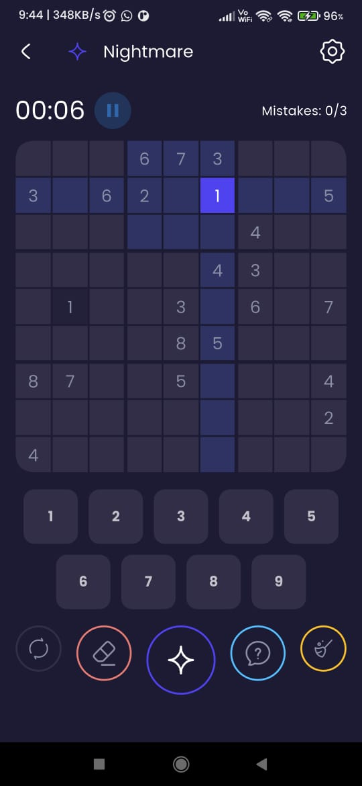
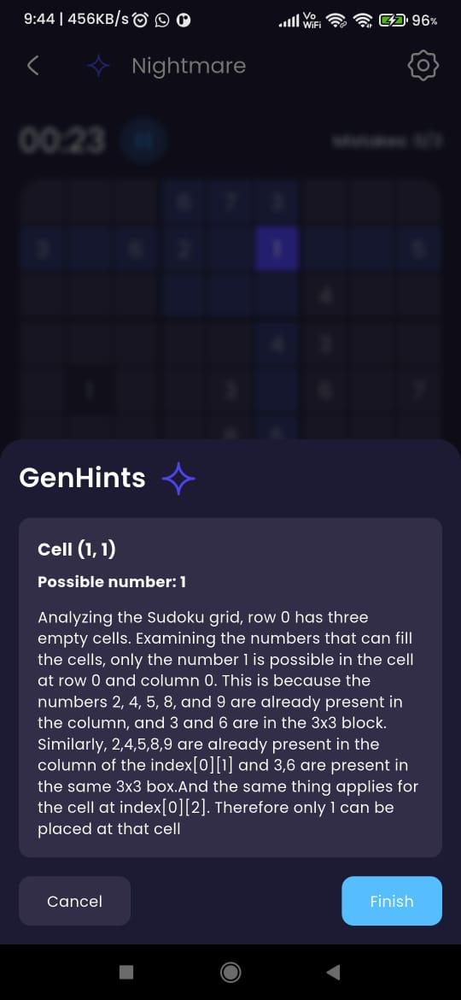
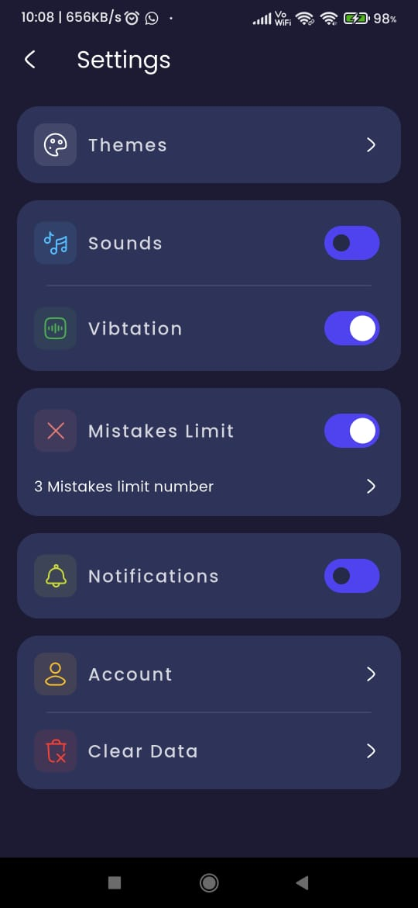

# SudokuMania [](http://makeapullrequest.com)

**A Flutter-based Sudoku game application with multiple difficulty levels, customizable themes, and intuitive UI for both casual and competitive players.**

## Description

SudokuMania is a fully-featured Sudoku game built with Flutter. Players can enjoy Sudoku puzzles across different difficulty levels, track their progress, and customize the game interface with themes and personalized settings. The app offers a smooth, responsive experience with light and dark themes, real-time game saving, and various utility options to enhance gameplay.

Key highlights include:
- **Multiple Difficulty Levels**: Easy, Medium, Hard, and Nightmare for varied challenge levels.
- **Theme Customization**: Switch between light and dark themes dynamically.
- **Game Progress Tracking**: Resume previously played games with saved progress.
- **Responsive UI**: Optimized for devices of various screen sizes.
- **Hints, Mistakes Tracking & Timer**: Improve strategy with game utilities and track performance.

---

## Features

- **Play Sudoku puzzles** at different levels of difficulty.
- **Save and resume games** seamlessly with progress tracking.
- **Light and Dark themes** with customizable UI appearance.
- **Hints and mistakes tracking** to guide players.
- **Responsive layout** adapting to screen sizes.
- **Simple and intuitive controls** for an enjoyable experience.

---

## 📸 Screenshots

| 1 | 2 |
|------|------|
|  |  |

| 3 | 4 |
|------|------|
|  |  |

---

## Installation

### Prerequisites

- Flutter SDK (latest stable version)
- Dart SDK
- Android/iOS device or emulator

---

### Clone the repository

```bash
git clone https://github.com/VijayAdithP/SudokuMania.git
cd SudokuMania
